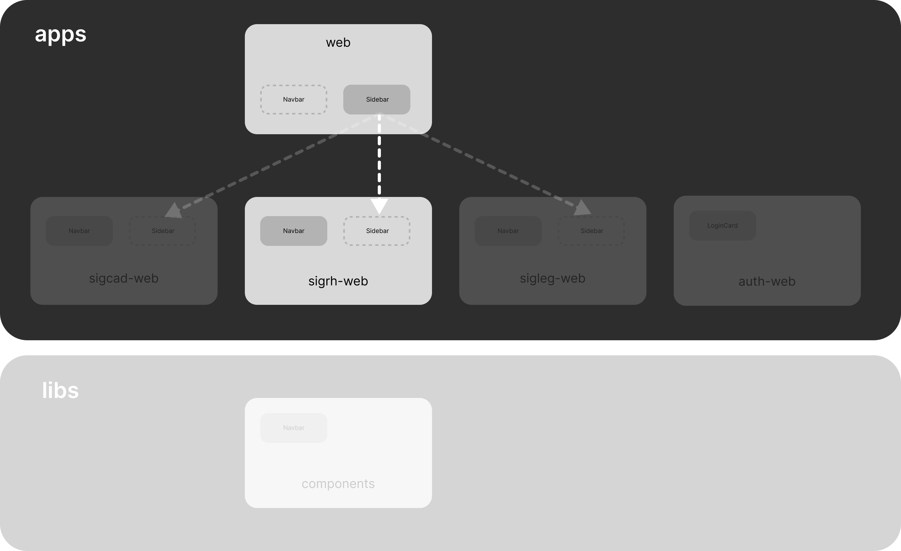

+

# microfrontends

Projeto para demonstrar como a aplicação do conceito de Micro Frontends pode beneficiar o desenvolvimento front-end do SIGESP

## Arquitetura

## Referências

- [Micro Frontends - extending the microservice idea to frontend development](https://micro-frontends.org/)
- [How We Build Micro Frontends With Lattice - Netflix Technology Blog](https://netflixtechblog.com/how-we-build-micro-frontends-with-lattice-22b8635f77ea)
- [Vue.js API Styles](https://vuejs.org/guide/introduction.html#api-styles)
- [Astro Framework](https://astro.build/)
